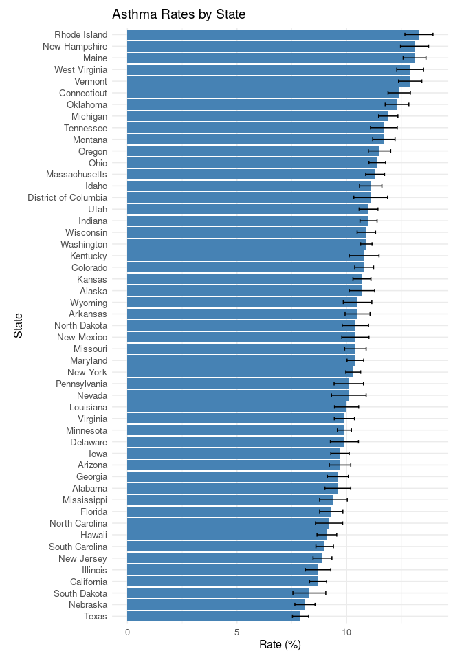

Final
================
Daven Lammi
2025-11-14

# ABSTRACT

# BACKGROUND

# STUDY QUESTION and HYPOTHESIS

## Questions

Do different regions of the U. S vary in asthma prevalence and mortality
rates?

## Hypothesis

We predict that regions that are more densely populated will experience
higher rates of asthma due to pollution from large cities.

## Possible Visualizations/ Test Statistic

barplot and t-test

## Barplot

Asthma Prevalence by U.S. Region

``` r
library(ggplot2)

ggplot(asthma_data, aes(x = region, y = prevalence)) +
  geom_boxplot() +
  labs(title = "Asthma Prevalence by U.S. Region",
       x = "Region",
       y = "Asthma Prevalence (%)") +
  theme_minimal() +
  theme(legend.position = "none")
```


Asthma Prevalence by U.S. State

``` r
library(ggplot2)
library(maps)
library(dplyr)

# Map data
states_map <- map_data("state")

# Merge map data with asthma data
map_data <- states_map %>%
  left_join(asthma_data, by = c("region" = "state_lower"))

ggplot(map_data, aes(long, lat, group = group, fill = prevalence)) +
  geom_polygon(color = "gray90", size = 0.3) +  # state borders
  geom_polygon(aes(fill = prevalence), color = "white") +
  coord_fixed(1.3) +
 scale_fill_gradientn(
  name = "Asthma Prevalence (%)",
  colors = c("yellow2", "orange", "red", "red4")
) +
  labs(
    title = "Asthma Prevalence by U.S. State",
    subtitle = "Higher prevalence shown in darker colors"
  ) +
  theme_void() +
  theme(
    legend.position = "right",
    plot.title = element_text(size = 16, face = "bold"),
    plot.subtitle = element_text(size = 12)
  )
```


map

``` r
ggplot(asthma_data, aes(x = population, y = prevalence)) +
  geom_point(aes(color=region)) +
  geom_text(aes(label = state_abrv), vjust = -0.5, size = 3)+
  labs(title = "Number of Individuals With Asthma vs. Asthma Prevalence by State",
       x = "Population",
       y = "Asthma Prevalence (%)") +
  theme_minimal()
```


<!-- -->

## Prediction

# METHODS

# DISCUSSION

## Interpretation - fill in analysis

## Interpretation - fill in analysis/plot

# CONCLUSION

# REFERENCES

3.  ChatGPT. OpenAI, version Jan 2025. Used as a reference for functions
    such as plot() and to correct syntax errors. Accessed 2025-11-14.
